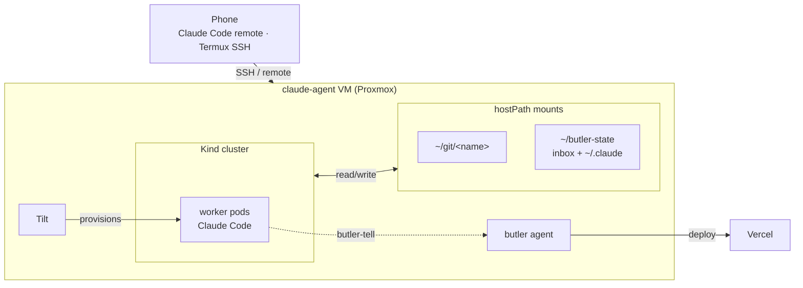

# cv-chat

A self-hosted, RAG-backed chatbot that answers questions about your career.

Forkable: drop in your own corpus (markdown, PDFs) and the bot speaks as you. Built on the [Vercel Chat SDK](https://chat-sdk.dev) — Next.js, AI SDK, Auth.js, Neon Postgres + pgvector, shadcn/ui.

**Live**: <https://cv.alexdarbyshire.com>

> **Status**: design / scaffolding. See [SPEC.md](./SPEC.md).

## Why

A static portfolio or CV forces a reader to skim. A chatbot lets them ask the actual thing they're curious about — *"have you led a team?"*, *"what's your experience with X?"*, *"what home-infra projects have you built?"* — and get cited answers grounded in your real history (commits, blog posts, project portfolios) rather than marketing prose.

It's a more honest interface to a body of work than a one-page summary can be.

## How (high level)

- **Theming framework-first**: shadcn CSS variables + Tailwind tokens. The bot can be re-skinned by editing one file.
- **Retrieval as a tool**: LLM calls `search_career_history(query)` over a pgvector index of your corpus. No prompt-stuffing.
- **Public access without login**: anonymous visitors get N free messages/day (IP rate-limit). Google sign-in raises the cap.
- **Corpus stays private**: ingestion script reads from a separate, private repo and emits embeddings — career history is never committed here.

## How this was built

A lot of this repo wasn't typed by me. It was written by AI workers running on a small home setup, and the setup itself is worth describing — partly because it's the differentiator between this and the original, and partly so anyone forking can see the moving parts if they want to follow the same pattern.

The cluster runs on a `claude-agent` VM (one of two Proxmox guests on a small home server). Workers are pods in a Kind cluster on that VM; each pod is a long-running Claude Code session. A separate **butler agent** on the same host holds the privileges the workers don't — a GitHub PAT, the Vercel CLI, the Anthropic OAuth tokens. Workers commit locally; the butler pushes branches, opens PRs, runs reviews, and merges. For diagnostic-logging commits I'd rather not put through PR review, the butler also deploys straight to prod via `vercel deploy --prod`, then merges (or doesn't) afterwards.

`workers.yaml` is the source of truth for the cluster. Add an entry, save, and Tilt provisions the namespace, secrets, NetworkPolicy, and Deployment automatically — no `kubectl apply`, no shell script. The same loop tears workers down when their entry is removed.

hostPath mounts wire the host filesystem into each pod: repos at `~/git/<name>` so workers operate on a real working tree, and `~/butler-state/` for shared state. The state mount carries two important things — a worker→butler inbox (workers run `butler-tell "subject" "body"` and a markdown file lands in the butler's queue) and a per-worker `~/.claude/` so Claude Code sessions resume across pod restarts.

The detail worth flagging: large parts of the polish phase weren't driven from a laptop. They were driven from a phone — sometimes via Claude Code's remote-control flow, sometimes via Termux SSH'd into the host attaching to the zellij session running on the VM. The PRs that landed in this repo over the last week were reviewed and merged from a phone. The original `interactive-cv-bot` was built agentically over a weekend on the couch; the do-over is being built agentically from a phone.

## Use it for yourself

1. Fork this repo
2. Point the ingestion script at your own corpus of work (private repo, local folder, anything)
3. Set env vars (Neon, Auth.js secret, Google OAuth, AI Gateway)
4. Deploy to Vercel

Full setup → [docs/SETUP.md](./docs/SETUP.md) (TBD)

## History

A do-over of [`interactive-cv-bot`](https://github.com/alexdarbyshire/interactive-cv-bot) (private), conceived and first deployed in June 2025 — agentically coded over a weekend on the couch. The original was built on the same Vercel chat-sdk template; the rewrite differs on three things:

- **RAG instead of env-var prompt-stuffing.** The original carried the corpus in a giant system prompt; that doesn't scale as the body of work grows.
- **Theming framework-first.** No more bespoke component overrides; everything flows from CSS-variable tokens.
- **PDF generation is content-vs-layout.** Schema-bounded JSON + typst, not LLM-produces-HTML. See [SPEC.md §3.8](./SPEC.md#38-tailored-resume-pdf-the-differentiator).

MIT-licensed so others can fork it for their own personal site.

## License

MIT

